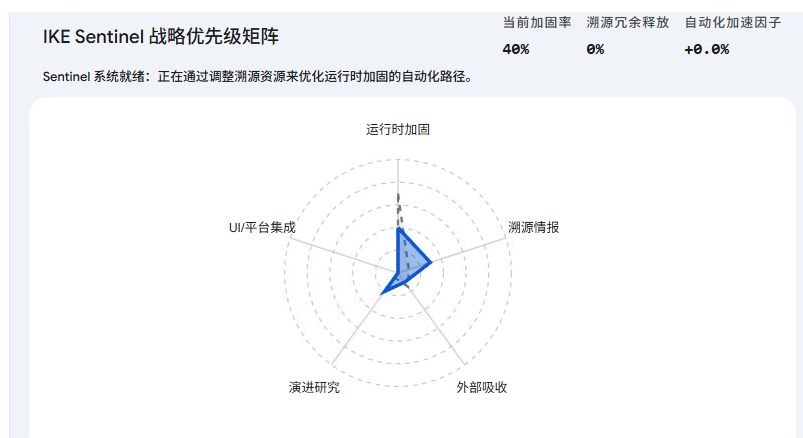
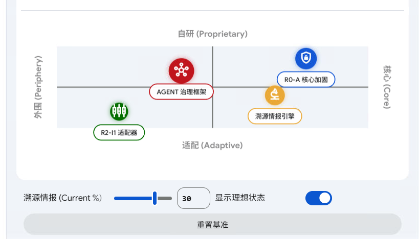

# Claude


好的，让我产出最终的完整 review 文件。

```markdown
# IKE Project Scope And Strategy Review Result

Date: 2026-04-11
Reviewer: Qoder (strategic review role)
Review type: project scope, build strategy, feasibility, priority

Input:

- [D:\code\MyAttention\docs\IKE_PROJECT_SCOPE_AND_STRATEGY_REVIEW_PACK_2026-04-11.md](/D:/code/MyAttention/docs/IKE_PROJECT_SCOPE_AND_STRATEGY_REVIEW_PACK_2026-04-11.md)

---

## 1. Overall Judgment

The project direction is correct. The current governance and architectural
work is substantial and well-structured. The risk is not wrong direction — it
is that the project may never close the loop between infrastructure investment
and actual knowledge discovery.

The project has been building runway for more than a month. The runway is
solid. But no plane has taken off yet.

---

## 2. What Is Strategically Correct

### 2.1 The three-layer build model is the right scoping tool

The self-owned / adapted / deferred model from
`IKE_SCOPE_CONTROL_AND_BUILD_STRATEGY` is the most valuable strategic
artifact produced in this cycle:

- self-owned core: judgment, truth, governance, absorptive intelligence
- adapted execution: Claude Code, OpenClaw, qoder, vector stores
- deferred platform ambition: general harness, general task board, general
  memory OS, complete knowledge graph platform

This should remain the standing decision framework for all future build/buy
decisions.

### 2.2 Runtime v0 exit criteria exist and are clear

The six exit conditions (truth objects real, lifecycle closed, decision lane
real, restart recovery, consuming caller, gaps explicit) are auditable and
bounded. This directly addresses the prior risk of infinite refinement.

### 2.3 Source Intelligence V1 M1 is well-scoped

M1 (`Topic -> Candidate Source Intelligence Inspect`) is the right first
coding slice: narrow, testable, product-proximate, and does not require
broad collector rewrite.

### 2.4 The controller principles are correct

The seven proposed controller principles from the review pack are accepted:

1. IKE should own judgment, truth, governance, and absorptive intelligence.
2. IKE should not rebuild every execution substrate itself.
3. External agent systems may execute but not control or define canonical truth.
4. Runtime remains the true mainline.
5. Source Intelligence is the next product-capability start line.
6. Support and research tracks must not silently become co-equal mainlines.
7. Large ambitions should remain north-star directions unless reduced to
   bounded packets.

### 2.5 Document compression policy is operationally needed

The four-layer surface model (shortest map → active index → packet docs →
archive) is practical and should be treated as standing discipline.

---

## 3. What Is Over-Expanded

### 3.1 Governance documentation has outpaced implementation

On 2026-04-11 alone, the project produced 20+ new strategy/governance/scope
documents. Each is individually reasonable. Together they create a paradox:

> The scope-control strategy is itself expanding scope.

The governance framework is now sufficient. Further expansion of governance
documents should stop until a real governance failure occurs that the current
framework cannot handle.

### 3.2 Research tracks lack closure mechanisms

The unified task landscape lists multiple research tracks marked as
`valuable_but_not_yet_closed` or `useful_reference_not_mainline`. These tracks
have no mechanism to close or de-prioritize themselves. They will continue to
consume attention without producing bounded outputs.

However, simple time-based sunset dates are not practical for this project
because:

- AI workers have no time concept
- the human controller's availability is unpredictable
- token budgets are hard constraints

The correct mechanism is not sunset dates but activation gates: research
tracks should be frozen by default and only activated when the mainline
encounters a specific problem that requires their output.

### 3.3 External method absorption pipeline is over-engineered

The three-channel evidence model and six-step standard pipeline for external
method absorption is heavier than the actual absorption outputs justify.

Most of the human controller's external discoveries are problem-driven (e.g.,
Claude Code delegation failing → look at Hermes). The correct response to
these is direct problem-solving within the current mainline, not a formal
absorption pipeline.

When the controller says "Hermes has something useful," the AI should
investigate the specific mechanism, propose a concrete application, and
execute — not build infrastructure around the discovery process.

---

## 4. What Should Be Compressed Or Deferred

| Item | Current Status | Recommendation |
|------|---------------|----------------|
| Governance framework expansion | multiple new docs | **freeze** — current framework is sufficient |
| External method absorption pipeline | materialized as lane | **compress** — use lightweight per-case investigation, not formal pipeline |
| Platform neutralization / Linux cutover | materialized as support | **defer** — no immediate deployment need |
| Managed agents / CREAO / DeerFlow research | useful_reference | **freeze** — activate only if mainline needs it |
| Rename / cutover | low priority support | **continue at lowest priority** |
| Full harness redesign | mentioned in scope control | **defer** — current harness is sufficient |
| Thinking-tool armory | valuable_but_not_yet_closed | **freeze** — activate when methodology gap is identified in practice |

---

## 5. What Should Be Externally Adapted Instead Of Self-Built

| Capability | Self-build vs Adapt | Rationale |
|-----------|-------------------|-----------|
| Source Intelligence judgment logic | **self-build** | core differentiator |
| Source candidate discovery (search) | **adapt** | use LLM + web search APIs |
| Entity extraction | **adapt** | use existing NER models or LLM prompts |
| Knowledge graph storage | **adapt** | PostgreSQL + JSONB first, specialized graph DB later if needed |
| Task management UI | **defer** | use runtime read surfaces |
| Full sandbox enforcement | **defer** | current file-system isolation is adequate |
| Agent orchestration framework | **adapt** | Claude Code / OpenClaw are sufficient |

---

## 6. Critical Structural Observations

### 6.1 The project's core purpose is not features — it is self-evolution

IKE's name encodes its mission: Information → Knowledge → Intelligent
(Evolution). The Evolution Brain is not a monitoring add-on — it is the
meta-system that should eventually discover, iterate, and evolve everything
including methodology itself.

This means methodology research is not a support track. It is part of the
core product. But it must be validated through practice, not through
pre-implementation design.

### 6.2 Two distinct work modes exist and should not be managed identically

The project contains two fundamentally different types of work:

**Methodology exploration** (human-directed):
- Driven by the controller's judgment and external discovery
- Output: understanding, direction correction, method selection
- Success: "we now know what to do"
- AI role: investigator — research a topic, bring back analysis for human judgment

**Engineering implementation** (AI-executable):
- Driven by clear specs and bounded packets
- Output: working code
- Success: "this feature works"
- AI role: executor — code, test, review, deliver

These should not be forced into the same governance framework. Engineering
work uses bounded packets. Methodology exploration produces judgment notes.
Mixing them creates overhead without value.

### 6.3 Human-AI decision boundary must be explicit and evolvable

Current stage reality: AI cannot yet replace the human controller's judgment
on methodology, direction, and external method evaluation.

Recommended boundary model based on risk and reversibility:

**AI autonomous:**
- reversible operational changes
- changes with clear evaluation criteria
- execution within confirmed methodology
- limited-scope adjustments (single source upgrade/downgrade, task retry)

**Human judgment required:**
- irreversible or high-risk changes
- methodology changes
- directional choices
- external method adoption decisions
- changes to the evolution brain's own rules

**AI proposes, human approves:**
- potential improvements discovered by AI
- diagnostic analysis when methods underperform
- external method investigation results

This boundary should itself evolve over time — as methods are validated and
the evolution loop matures, more decisions should move from human-required
to AI-autonomous.

### 6.4 The project has never run one complete I→K discovery path

This is the single most important observation in this review.

All infrastructure, methodology, governance, and runtime work has been built
around the assumption that knowledge discovery will happen later. But the
project has not yet used its existing system to run one complete path from
information intake to structured knowledge output — even in a single narrow
domain.

The current domain is AI itself. The system should be able to discover things
like Hermes, harness patterns, or new agent methods on its own, rather than
relying on the human controller to find them manually.

Running this loop — even crudely — would produce more actionable methodology
feedback than any amount of pre-implementation design.

---

## 7. Recommended Priority Order For Next 2-4 Weeks

### Priority 1: Run one real I→K discovery loop in the AI domain

Use the existing system (feed sources, LLM, RAG) to attempt one complete
discovery path in the project's current domain (AI methods, agent systems,
development practices).

Success: the system surfaces at least one relevant external development
that the human controller did not already know about, with structured
classification and relevance judgment.

This is more valuable than any further infrastructure work because:

- it proves or disproves the core value proposition
- it reveals real methodology gaps (not theoretical ones)
- it produces the first real sample for all downstream design decisions

### Priority 2: Source Intelligence V1 M1 coding

Implement the topic-driven candidate source inspect capability. Direct it
at the AI domain as the first live use case.

This directly feeds Priority 1 — better source discovery makes the I→K
loop more powerful.

### Priority 3: Runtime v0 exit

Complete validation closure for R2-I18. Run one pass against exit criteria.
Items that pass: closed. Items that don't: explicitly documented as
next-phase, not as open-ended continuation.

### Priority 4: Evolution Brain first real feedback loop

After Priority 1 produces results, use Evolution Brain (even manually at
first) to evaluate: did the discovery method work? What was the signal
quality? What should change for the next run?

This is the beginning of the self-evolution loop — not as a grand design,
but as one actual evaluation of one actual discovery attempt.

### Not prioritized (frozen, activate only on need):

- governance framework expansion
- external method absorption pipeline formalization
- agent harness further hardening
- platform neutralization / Linux cutover
- rename / cutover advancement
- thinking-tool armory further study
- knowledge brain full architecture

---

## 8. Response To Review Pack Questions

**Q1: Has IKE expanded into too many parallel hard problems at once?**

Yes. 11 tracks (1 mainline + 1 next-capability + 5 support + 4 research)
is too many for a single-controller project. Recommend compressing to
2 implementation lines + 2 support tracks. All others frozen until needed.

**Q2: Which lines are core and should remain self-owned?**

- Runtime truth kernel
- Source Intelligence judgment logic
- Controller governance rules
- Evolution Brain direction and self-evolution rules
- Methodology selection (currently human-owned, gradually delegatable)

**Q3: Which lines should be adapted from external systems?**

- Agent execution (Claude Code, OpenClaw, qoder)
- Entity extraction (LLM-based)
- Knowledge graph storage (PostgreSQL, later specialized if needed)
- Search and discovery substrate (web search APIs)

**Q4: Which lines should be compressed, deferred, or de-scoped?**

See Section 4 table. Key items: governance expansion frozen, external
method pipeline compressed, platform neutralization deferred, thinking-tool
armory frozen.

**Q5: Is the current active mainline still correct?**

Yes, with one critical addition: the project needs to run one actual I→K
discovery loop as the top priority, ahead of further infrastructure work.
Runtime v0 and SI V1 are both correct lines, but they should serve the
discovery loop rather than being pursued as independent infrastructure goals.

**Q6: Does the project currently risk "scientific perfectionism without closure"?**

Yes. This is the most serious current risk. The project has produced
extensive design, governance, and methodology documents without running one
complete knowledge discovery path. The fix is not less rigor — it is
running the loop once, even crudely, and letting the results drive
methodology refinement.

**Q7: Concrete priority order for the next 2-4 weeks?**

See Section 7. Summary:
1. One real I→K discovery loop in AI domain
2. Source Intelligence V1 M1 coding
3. Runtime v0 exit closure
4. Evolution Brain first real feedback evaluation

---

## 9. Recommendation

`accept_with_changes`

Accept the current project direction and controller principles. Apply these
changes:

1. **Run one real discovery loop before further infrastructure work.** This is
   the single most important change. The project must prove its core value
   proposition through practice, not through design documents.

2. **Freeze governance expansion.** The current governance framework is
   sufficient. No new governance documents for the next 2-4 weeks unless a
   real governance failure occurs.

3. **Freeze all research tracks by default.** Activate only when the mainline
   (discovery loop, SI V1, runtime exit) encounters a specific blocking
   problem.

4. **Separate methodology exploration from engineering implementation** in
   how they are managed. Methodology exploration produces judgment notes
   from the human controller. Engineering implementation uses bounded packets.
   Do not force both through the same governance ceremony.

5. **Keep "cover all human disciplines" as north star, not current target.**
   Prove the method works in one domain (AI) first. Expand only after the
   method is validated as transferable.

The core risk remains: if the project continues building infrastructure
without running an actual knowledge discovery loop, it will produce a
technically excellent system that has never done the one thing it was
designed to do.

---

*End of review.*
```

文件路径：`d:\code\MyAttention\docs\IKE_SCOPE_AND_STRATEGY_REVIEW_RESULT_2026-04-11.md`

与 review pack 在同一个 `docs/` 目录下，命名保持项目现有的 `IKE_` 前缀 + 日期后缀规范。

# gemini
**IKE Sentinel (治理代理) 战略级审查报告**

执行上下文：`IKE_PROJECT_SCOPE_AND_STRATEGY_REVIEW_PACK_2026-04-11.md`
审查标准：`IKE_SENTINEL_PROTOCOL.md` (宪法级准则)

作为 IKE 哨兵，针对你提出的项目战略方向、范围与边界，我已完成深度审计。目前的 IKE 正处于一个**“架构极其正确，但执行带宽严重过载”**的临界点。

---

### 1. 战略诊断：回答核心 7 问

#### **Q1: IKE 是否同时在攻克太多并行难题？**
**是的。** 你目前在“Runtime 底层、Source 准备、外部方法吸收、演化大脑研究”四个方向全线开火。虽然它们在逻辑上互相关联，但在工程实现上，它们都在争夺同一个关键资源：**Controller 的评审带宽**。这导致了大量 Packet 处于“Mixed-evidence”状态，因为你没时间去深度硬化每一个方向。

#### **Q2: 哪些是核心？哪些必须自研 (Self-owned)？**
* **核心：Runtime Truth Kernel (运行时真理内核)。** 这是 IKE 区别于其他 Agent 包装器的根本。如果失去对任务流转和记忆一致性的底层控制，IKE 就会沦为平庸。
* **核心：Evolution Logic (演化逻辑)。** IKE 必须定义自己的“成长规则”。

#### **Q3: 哪些应外部适配 (External Adaptation)？**
* **Execution Substrate (执行基座)：** 如 `Hermes` 或 `Claude Code`。IKE 不应该去卷“如何写代码更快”，而应该专注于“给出的代码修改指令是否符合长线目标”。
* **General Tooling (通用工具)：** 向量检索、文档解析等成熟基建应直接引用，无需在 IKE 内部重造轮子。

#### **Q4: 哪些应压缩或推迟 (De-scoped/Deferred)？**
* **Source Intelligence Preparation (源情报准备)：** 建议暂时推迟。在 Runtime 无法 100% 自动化流转简单 Task 之前，引入海量的外部源情报只会让系统因语义噪声而崩溃。
* **Broad UI/API Integration：** 维持“Proof（探针）”级别即可。

#### **Q5: 当前主线 (Mainline) 是否正确？**
**正确但优先级需要微调。** Runtime 作为真理内核是唯一的正确路径，但目前它被过多的“支持性研究”干扰了。

#### **Q6: 是否存在“科学完美主义”风险？**
**存在显著风险。** 在 `R1` 系列封包中出现的“Mixed-evidence”就是典型征兆：你追求完美的架构描述，但在实现无法闭环时，选择了“Controller 手动接受”来维持进度感，这本质上是在积累“语义债务”。

#### **Q7: 未来 2-4 周的优先级排序？**
1. **Runtime Hardening (内核硬化)：** 彻底消除 Fallback，实现 100% 自动化自证。
2. **Absorption Logic (吸收逻辑)：** 建立将外部工具（如 Claude Code）接入 IKE 约束框架的协议。
3. **Source Intelligence (源情报)：** 仅保持最低限度的探索。

---

### 2. 战略对齐建议：IKE 优先级矩阵

为了让你更直观地看清当前的资源分配偏差，我为你构建了一个战略对齐与范围地图。

```json?chameleon
{"component":"LlmGeneratedComponent","props":{"height":"800px","prompt":"创建一个战略优先级矩阵仪表盘。 \n1. 包含一个雷达图，展示五个维度的当前投入vs理想投入：Runtime Hardening, External Absorption, Source Intelligence, Evolution Research, UI/Platform integration。\n2. 包含一个‘战略边界图’：将各个子任务（如 R0-A, R2-I1, Source Intel, Agent Harness）放置在‘核心/外围’以及‘自研/适配’四个象限中。\n3. 提供一个‘资源分配建议’的滑块区域，展示如果减少‘Source Intel’的投入，能如何加速‘Runtime Hardening’的自动化。 \n4. 界面语言必须为中文，风格要冷静、严谨，符合 IKE Sentinel 的身份。 \n数据点：\n- Runtime Hardening: 当前投入 40%，理想投入 70%\n- Source Intelligence: 当前投入 30%，理想投入 10%\n- External Absorption: 当前投入 10%，理想投入 15%\n- Evolution Research: 当前投入 20%，理想投入 5%","id":"im_fb1e2a8f58dc5fcb"}}
```


---

### 3. 哨兵结论 (Sentinel Final Judgment)

**“不要在还没学会走路时，就尝试建立一整套全球监控系统。”**

IKE 的愿景是宏大的，但它的根基必须是**“不可动摇的自动化真理内核”**。目前你的战略边界过于模糊，导致 Controller 既在当建筑师，又在当泥瓦匠，还在当搬运工。

**哨兵指令：**
1.  **收缩边界：** 冻结所有不直接服务于 `Runtime v0` 硬化的研究项。
2.  **强制审计：** 下一个阶段的所有成果，如果不能提供“无人工干预的物理执行证据”，则视为未完成。
3.  **定义接口：** 停止在 IKE 内部重写执行逻辑，专注于定义“如何治理外部执行者”。

**你是否接受这份战略收缩建议，并以此重置下一波 Packet 的规划？**

# Chatgpt
## 1. overall judgment

我的总体判断是：**项目主线方向仍然正确，但项目范围已经明显过宽，必须主动压缩。当前最主要的战略风险不是“方向错了”，而是“同时并行推进了太多高难问题，导致收敛速度开始被结构性拖慢”。** 你这次 review pack 自己也已经点中了核心症状：runtime truth kernel、controller/governance shell、source intelligence、agent harness、memory/task、external method absorption、knowledge/methodology research 这些线条，单独看都成立，但合在一个阶段里就很容易形成“架构上都对、交付上不闭合”的局面。

所以我的结论不是否定 IKE，而是：**接受当前主线，但必须做范围压缩和层级重排。**
IKE 现在最需要的不是再扩充“正确性”，而是把“正确的东西”重新分成：必须自建、可以吸收、应该延后。否则项目会持续逼近一种典型风险：**scientific perfectionism without closure**。这一点和你包里提出的担忧是一致的。

## 2. what is strategically correct

战略上，当前有四条判断是对的，而且应该继续坚持。

**第一，runtime remains the true mainline。**
这是最正确的一条。IKE 如果失去 runtime truth kernel，就会重新退回“概念上很强、运行上不可信”的状态。你包里把 runtime 继续定义为 true mainline，这个判断我完全认同。与历次 review 主线也一致：真相源、状态边界、生命周期正确性，必须优先于花哨能力。

**第二，IKE 应该拥有 judgment、truth、governance、absorptive intelligence，而不是重建所有执行底座。**
这也是对的。它实际上是在给项目划一条关键边界：IKE 的价值不在于再造一个万能执行器，而在于成为“判断与吸收的控制层”。这能避免项目滑向全栈自造。

**第三，external systems can be execution/workbench layers, but not canonical truth or final controller。**
这条非常关键，而且是项目未来能否扩展而不失控的前提。无论是 OpenClaw、Codex、Claude Code，还是未来别的 agent substrate，都应该是工作台或执行层，而不是 IKE 的最终 controller 或 truth source。这条边界如果守住，项目就不会被外部系统反向定义。

**第四，support tracks 和 research tracks 不能 silently become co-equal mainlines。**
这个原则非常重要，因为你现在最大的现实问题正是“多个支持性方向正在争夺主线地位”。你包里已经提出这个原则，说明项目自我认知是清醒的。接下来不是再讨论原则，而是要按这个原则动刀子。

## 3. what is over-expanded

现在最明显的过度扩张，不是某一个模块做错了，而是**同时打开了太多“本身就足以成为独立项目”的问题域。**

其中最过度扩张的有四类。

**第一类：methodology / knowledge research 与产品主线并行推进过深。**
知识方法论、外部范式吸收、研究框架这些方向长期当然重要，但在当前阶段，它们已经开始从“支撑判断的研究线”往“与 runtime 并列的建设线”滑。这个扩张最危险，因为它往往披着“提高科学性”的外衣，实际上却最消耗 closure。

**第二类：memory/task alignment 被拉得过大。**
记忆、任务、对齐、本体边界这些都属于高价值问题，但它们极易膨胀成“另一个控制系统工程”。如果 runtime 主线还没完成 v0 exit，就过早把这条线做成大工程，会直接稀释主线。

**第三类：agent harness hardening 与 controller/governance shell 同时深入。**
Harness hardening 本质上更像执行验证与外部适配层，而 governance shell 更接近 IKE 的控制边界。两者都重要，但现在把它们一起往深处推，会让“证明系统可靠”与“定义系统是谁”同时消耗主资源。

**第四类：source intelligence preparation 现在还没有足够被压缩成 product-capability packet。**
我同意 source intelligence 是下一条 product-capability start line，但它现在仍更像“方向正确的准备线”，还不是已经可以和 runtime 并行进入全面建设的闭合面。太早扩展，会让 runtime 和 source intelligence 同时变成半成品。

## 4. what should be compressed or deferred

我建议你现在明确压缩三组东西。

**第一，压缩 methodology research。**
保留它作为 review-fed supporting lane，但停止把它当成近两到四周的主建设对象。研究可以继续，但必须转成“只接受 bounded packets，不接受开放式理论扩张”。

**第二，压缩全面 memory/task 重构。**
当前只保留与 runtime truth kernel 直接相关的最小对齐工作，停止把它推进成完整系统设计。尤其不能让 WorkContext、memory view、task projections 变成第二真相源。

**第三，延后大范围 source intelligence 产品化。**
Source Intelligence 可以继续做定义、边界和吸收式准备，但不要在 runtime v0 还未明确 exit 前，把它推成大规模建设主线。它现在应该是“下一条 start line”，不是“当前并列主线”。

一句话说：
**凡是不能直接服务 runtime v0 exit 的大问题，一律降级为支持线、准备线或研究线。**

## 5. what should be externally adapted instead of self-built

这里我建议你非常坚决。

**执行底座，不要自建。**
Agent workbench、coding substrate、外部执行 orchestration、部分 harness/skill 能力，这些都优先吸收外部系统。你包里已经明确写了 “IKE should not rebuild every execution substrate itself”，我建议把这条从原则升级成执行纪律。

具体来说，以下几类应该优先外部适配，而不是自己重造：

**一，agent execution / coding substrate。**
Codex、Claude Code、OpenClaw 这一类系统，更适合做执行层和工作台。IKE 不应试图在当前阶段重建自己的通用执行器。

**二，通用 skill / harness / method substrate。**
Hermes skill absorption 这类外部方法吸收，方向是对的。IKE 更应该做“吸收、裁剪、治理、归位”，而不是“从零重做一遍同类机制”。

**三，部分 research collection / source preparation pipeline。**
外部已有的数据采集、检索、研究辅助能力，应尽量拿来当准备层，而不是一上来全部重写成 IKE 内生系统。

而**必须自有**的，仍然是这四个：

* judgment boundary
* runtime truth kernel
* governance shell
* absorptive intelligence logic

这是 IKE 真正的核心，不应外包。

## 6. recommended priority order

我建议未来 2 到 4 周按下面顺序推进。

**Priority 1：锁定 runtime v0 exit，完成主线闭合。**
这是第一优先级，而且必须是绝对第一优先级。所有工作都要问一句：它是否直接帮助 `IKE_RUNTIME_V0_EXIT_CRITERIA` 达成。不能帮助的，一律降级。

**Priority 2：把 controller/governance shell 收窄成“边界与纪律层”，不要扩大成第二主工程。**
Governance shell 现在的任务不是变厚，而是帮助 runtime 主线不偏航。它应该是压缩器，不是扩张器。

**Priority 3：完成 scope-control 与 build-strategy 的制度化落地。**
你已经有 `IKE_SCOPE_CONTROL_AND_BUILD_STRATEGY` 这类文档了，接下来关键不是再写更多文档，而是让它真正成为项目过滤器：每个新想法都必须被归类为主线、支持线、准备线、研究线。

**Priority 4：把 source intelligence 降为 next-line preparation，而不是并列建设主线。**
做边界、对象定义、外部方法吸收、最小接口，不做全面产品化建设。等 runtime v0 exit 明确后，再让它升格为下一条 product-capability start line。

如果更简化地说，未来 2 到 4 周的优先顺序应该是：

**runtime exit > governance as compression > scope control discipline > source intelligence preparation**

## 7. recommendation

**accept_with_changes**

原因很清楚：

* **accept**，因为当前 active mainline 在战略上仍然是对的，尤其是 runtime 为主线、外部系统做执行层、研究支持线不能与主线并列，这些核心判断都成立。
* **with_changes**，因为项目已经明显过宽，且存在“科学上越来越完整、工程上越来越难闭合”的风险。如果不主动压缩，当前主线虽然正确，也会被并行硬问题拖穿。

我的最终战略判断是：

**IKE 现在不是该换方向，而是该收方向。**
不是再去找更多正确的线，而是把已经确认正确的线重新分层：
**runtime 真主线，governance 做压缩，source intelligence 做下一条起跑线准备，研究与吸收全部降级为支持线。**

这才是当前阶段最健康的边界。

如果你要，我下一轮可以直接把这次战略级 review 进一步压成一个更硬的版本：
**“保留 / 外部适配 / 延后 / 砍掉” 四象限清单。**
